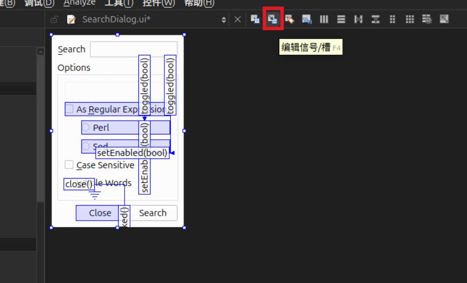
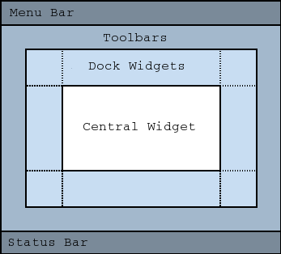

# Introduciton to Qt Widgets 
[YouTube video Link](https://www.youtube.com/playlist?list=PL6CJYn40gN6iFcTyItvnE5nOmJR8qk_7o)


## Moudle 1 


### part 01

- Qt Widgets - > desktop application

- Qt QML -> embedded device, mobile device

>basicly based on what‘s your application looks like. 


 

### part 02

[qmake-tutorial.html](https://doc.qt.io/qt-6/qmake-tutorial.html)

[cmake-get-started.html](https://doc.qt.io/qt-6/cmake-get-started.html)

[KDToolBox](https://github.com/KDABLabs/KDToolBox)

### part 03 Qt helper

shortcuts:
- F1 -> help documentation
- F2 -> go to defination

### part 04 QObject


- 并非所有 Qt 类是派生自 QObject
- 并非所有 Qt 对象需要使用对象树管理生存周期和内存
- 并非所有 QObject 类的派生类都是可视类型（for example : QFile)


### part 05 QWidget
 


Layout 布局管理器，不参控件生命周期管理；
`widget->setLayout(layout); ` 布局管理器中的所有控件会被加入 widget 的子对象树中。

### part 06 signals and slots

[wiki.qt.io::New_Signal_Slot_Syntax](https://wiki.qt.io/New_Signal_Slot_Syntax)


三种信号槽连接方式
- 槽函数指针


对于存在函数重载情况
[signalsandslots.html#connecting-to-overloaded-signals-and-slots](https://doc.qt.io/qt-6/signalsandslots.html#connecting-to-overloaded-signals-and-slots)

- SIGNAL() / SLOT()  宏 (Qt4)
- 函数对象（函数包装器，lambda 表达式）


### part 07 SIGNAL() / SLOT()  宏 (Qt4)


- 能够显示指定重载函数的参数类型
- 其底层是基于字符串形式的函数签名，由 moc 在编译前生成，其功能绑定发生在运行时（根据函数签名字符串遍历）；
- 没有类型检查

### part 08 信号连接 Lambda 表达式 / 函数包装器 /  独立函数指针 `【无接收者】`


lambda 是一个匿名函数，不需要信号的接收者。但需要保证 lambda 表达式捕获的上下文环境的有效性。

信号槽连接的自动生命周期管理，sender 或 receiver 销毁后，连接会自动被释放。lambda 表达式没有接收者，存在上下文失效的风险.（[signalsandslots.html#automatic-connection-management](https://doc.qt.io/qt-6/signalsandslots.html#automatic-connection-management)）。

[code example](https://github.com/KDABLabs/kdabtv/blob/master/Programming-With-Qt-Widgets/objects/ex-connect-function-pointers/main.cpp#L24)

**信号槽连接规则**
- 参数关系


- 信号参数个数 ≥ 槽函数参数个数
- 参数从` 右  ->  左 `匹配

- 连接关系


**信号槽 的建立与销毁**


对于无接收者的情况（使用lambda 、函数包装器、独立函数指针）


### part 09 自定义信号、槽函数

- 自定义槽函数
    
    - 槽函数就是成员函数，可以设置权限，并且可以被外部或其他成员函数调用
    - 任意成员函数也可以作为槽函数(无须slot)，连接信号槽（Qt5）; `不能兼容 Designer, 其只识别 slot`

- 自定义信号


- 信号默认是，也只能是public，任何情况都不应给信号添加权限；
- 信号槽连接的参数传递是`强制值传递`

- 信号槽连接传递的参数类型
    - 单线程的直接连接 / 多线程的直接连接 ： 可直接使用内置类型和自定义数据类型
    - 单线程的队列连接 / 多线程队列连接： 必须使用 `Q_DECLARE_METATYPE + qRegisterMetaType`注册自定义类型（需要使用事件循环，事件派发任务队列需要序列化和反序列化）

> 直接连接，槽函数都是在是在发送者所在线程执行的；多线程直接连接，存在竞态条件的风险。


### part 10 signal


`emit signal`  : ` emit` 宏实际上没有任何意义，只是方便阅读

### part 11

**QMetaObject**
存储 QObject 以及 Q_OBJECT 提供功能的一些信息。

[GammaRay wiki](https://github.com/KDAB/GammaRay/wiki) 运行时手动修改 Qt 属性

### part 12 Event System

[The Event System](https://doc.qt.io/qt-6/eventsandfilters.html)


  
- widget 绘图


### part 13 & part 14 Qt Designer

[Qt Widgets Designer Manual](https://doc.qt.io/qt-6/qtdesigner-manual.html)
[Using a Designer UI File in Your C++ Application](https://doc.qt.io/qt-6/designer-using-a-ui-file.html)
1. 创建带UI文件的项目


2. 创建带UI文件的窗口类


类内组合一个用于窗口绘制的代理类 Ui::ClassName 对象


经过 UIC 把 UI 文件转译成 C++ 类文件，其内部代理了界面绘制动作


窗口控件本体在构造函数内将绘制动作委托给 UI 类的 setupUi 方法


### part 15 **Layout in Qt Designer**


- 直接将多选的控件设置 layout, 会默认新建一个隐式的 widget；应该直接为其父 widget 设置 layout ；

- 已经布局的控件窗口，再拖动增加控件比较困难, 可以直接拖入对象列表
    
    - spacer 、子控件的sizepolicy 配合使用，实现自定义布局
    
### part 16 signals slots in Designer

- 图形界面，拖动连接信号槽


- 手动设置信号槽连接


- 转到槽

    - 选择信号
    
    - 自动生成信号对应的槽函数
    
    - 在对应窗口控件自动生成的 ui_ClassName.h 中， moc 会根据信号签名搜索形如 on_object_signal() 的槽函数并连接
    
    > 问题在于，如果 .ui 文件中的控件对象名属性被修改，之前自动生的的槽函数的函数名不会被自动修改，导致编译错误（无法根据对象名属性找到正确的槽函数）
    
### part 17 buddies and Tab order

[Widgets 焦点系统](https://doc.qt.io/qt-6/focus.html)

- 设置 Buddies (专门用于 QLable 的焦点绑定，配合 Alt + 助记符)
  - 当 Alt + 助记符 快捷键命中时，焦点会自动移动到 label 绑定的 buddie 上
  - 图形界面拖动
  
  - cpp代码手动设置
   ```cpp
    QLabel *nameLabel = new QLabel("&Name:");
    QLineEdit *nameEdit = new QLineEdit;
    nameLabel->setBuddy(nameEdit);
    ```


- Alt 快捷键
    在对应控件的属性编辑器中，将 text 修改， 在想作为 Alt 键的字母前加 & ；
    

    - Alt + 字母 快捷键字母会加下划线， 快捷键为 Alt + S
    
    - 不仅首字母可以作为快捷键，此处 text= As &Regular Expression ， 快捷键为 Alt + R
    
    
- Tab order
    - 图形 界面设置 Tab 顺序
     
    - 鼠标点击，自动排序
    


### part 18 custom widegt
  

- [自定义 Designer 插件](https://www.youtube.com/watch?v=LGzNWFHUvpM&list=PL6CJYn40gN6iNg0nIYH4QLhYkfs5PslbA) (KDAB's palylist from youtube)

- 窗口控件提升： 将 Designer 中的默认控件，替换为其他非默认的控件类
    - 提升为的类，必须是被提升的默认控件类的子类
    - 提升为的类，可以是自定义的类，可以是 Qt 框架内的类
    
[qtpdf-pdfviewer-example.html](https://doc.qt.io/qt-6/qtpdf-pdfviewer-example.html) (官方实例，将 ui 文件中的 QWidget 提升为 Qt 框架内的 QPdfView)

*将被提升的默认窗口控件*

*设置提升的目标类，此处使用 Qt 框架内的类，不需要 `全局包含`*

*提升成功*


> 提升为自定义类：
    - 自定义类头文件需要用预先定义，必须是被提成控件的派生类
    - 头文件需要全局包含
    
`静态用户界面，尽量使用 UI 文件`

### part 20 common widgets


- [QLabel](https://doc.qt.io/qt-6/qlabel.html)

    


- [QLineEdit](https://doc.qt.io/qt-6/qlineedit.html) & [QTextEdit](https://doc.qt.io/qt-6/qtextedit.html)
    


> QPlainTextEdit : 对比 QTextEdit  ，功能单一（仅读写），但刷新性能强，适合高速刷新文本的处理


### part 21 buttons


- [QButtonGroup](https://doc.qt.io/qt-6/qbuttongroup.html)
    - 不可视控件组，区别于 QGroupBox 
    - 专用于管理 button 的逻辑状态，既其选中状态 `setExclusive(true)` 设置其中的可选中按键为互斥（按键组默认互斥）
    - 不管理其内的按钮的生命周期，区别于 QGroupBox；**不会**将其内的控件的父对象设置为其本身的父对象，区别于 layout
    
- QRadioButton 如果拥有同一个父对象，则只能选中一个，并且取消其他按钮的 toggle 状态（互斥）

[qgroupbox.html](https://doc.qt.io/qt-6/qgroupbox.html)
[qpushbutton.html](https://doc.qt.io/qt-6/qpushbutton.html)
[qcheckbox.html](https://doc.qt.io/qt-6/qcheckbox.html)
[qradiobutton.html](https://doc.qt.io/qt-6/qradiobutton.html)
**value widgets**


[qslider.html](https://doc.qt.io/qt-6/qslider.html)
[qprogressbar.html](https://doc.qt.io/qt-6/qprogressbar.html)
[qspinbox.html](https://doc.qt.io/qt-6/qspinbox.html)

### part 22 widgets organizer


[qgroupbox.html](https://doc.qt.io/qt-6/qgroupbox.html)
[qtabwidget.html](https://doc.qt.io/qt-6/qtabwidget.html)
[qtoolbox.html](https://doc.qt.io/qt-6/qtoolbox.html)
[qscrollarea.html](https://doc.qt.io/qt-6/qscrollarea.html) 

### part 23 item widgets


### part 24  [layout management](https://doc.qt.io/qt-6/layout.html)

- 放置和尺寸


- 水平布局


- 网格布局


- 表格布局（两列布局）
 


[Flow Layout Example](https://doc.qt.io/qt-6/qtwidgets-layouts-flowlayout-example.html) 响应式布局示例


### part 25 strecthing and spacing 拉伸和填充


- 间距 （spacing）： layouts 中相邻控件之间的距离，通过 [setSpacing(int) ](https://doc.qt.io/qt-6/qlayout.html#spacing-prop)设置（默认值因平台而异，通常为 6px）


- 边距（margin)    ：  layout 内部布局中的控件，与 layout 边缘的空间（可以理解为内部控件与被设置 layout 的父窗口的边缘空间）
    - [setContentsMargins(int left, int top, int right, int bottom)](https://doc.qt.io/qt-6/qlayout.html#setContentsMargins-1)设置（默认值通常为 11px）。
    - 作用：控制界面的“留白”，避免控件拥挤或边缘紧贴窗口，提升视觉舒适度。
    
- 拉伸因子 ：决定控件在布局中的“占比权重”，当<mark>窗口大小变化时</mark>，控件会按比例分配<mark>额外空间</mark>
    - 对 QVBoxLayout/QHBoxLayout，通过 addWidget(widget, stretch) 为单个控件设置拉伸因子。
    - 对 QGridLayout，通过 setRowStretch(row, stretch) 和 setColumnStretch(col, stretch) 为整行/整列设置拉伸因子。
    - 例：在 QHBoxLayout 中，若两个按钮的拉伸因子分别为 1 和 2，则窗口宽度增加 30px 时，第一个按钮会增加 10px，第二个增加 20px。
    - 内部控件可以设置自身的 stretch factor，但会被 layout 的 stretch factor 覆盖
    


- 尺寸策略 ：每个控件都有默认的尺寸策略（[QSizePolicy](https://doc.qt.io/qt-6/qsizepolicy.html#details)），决定了它在布局中的拉伸/收缩行为
    - QSizePolicy::Fixed：尺寸固定，不随布局变化（如 setFixedSize 效果）。
    - QSizePolicy::Minimum：最小尺寸为 sizeHint()，可放大但不小于此值。
    - QSizePolicy::Maximum：最大尺寸为 sizeHint()，可缩小但不大于此值。
    - QSizePolicy::Preferred：优先使用 sizeHint()，但可放大或缩小（默认策略）。
    - QSizePolicy::Expanding：主动占据额外空间，适合填充布局的控件（如 QTextEdit）。
   
- [sizeHint](https://doc.qt.io/qt-6/qwidget.html#sizeHint-prop) : 控件的「推荐大小」，QLayout 在布局计算时，会优先参考这个值 [qtwidgets-layouts-flowlayout-example.html](https://doc.qt.io/qt-6/qtwidgets-layouts-flowlayout-example.html)


>布局运行时，会根据上述多个属性结合使用，决定最终布局效果。

### part 26 Guidelines for Custom Widgets


- Qt 自定义 API，设计指南
    - [Designing Qt-Style C++ APIs](https://doc.qt.io/archives/qq/qq13-apis.html)
    - [api-design.pdf](./vx_assets/api-design.pdf)
    
### part 27 **Validating  Input**

[Input Masks and Validators ](https://www.ics.com/blog/qts-approach-input-validation-masks-and-validators-explained)

- Input Mask ：在用户输入时实时检查，错误格式无法输入


[ex-inputMasks](https://github.com/KDABLabs/kdabtv/tree/master/Programming-With-Qt-Widgets/text-processing/ex-inputMasks)

- Validator ： 每次输入变化 / Enter / 失焦 都会被调用


> 会根据返回的值，自动处理（自动更正，使用fixup）

`实质上 mask 和 validator 并不会对用户输入数据进行处理，只是保证其格式的正确性`

[MasksValidators](https://github.com/integratedcomputersolutions/blogs/tree/MasksValidators)


**[QCompleter](https://doc.qt.io/qt-6/qcompleter.html#details) 补全器**

[ex-completer](https://github.com/KDABLabs/kdabtv/tree/master/Programming-With-Qt-Widgets/text-processing/ex-completer)

[文本自动补全案例(Qt)](https://doc.qt.io/qt-6/qtwidgets-tools-customcompleter-example.html)

### part 28 [Resource System](https://doc.qt.io/qt-6/resources.html)

将图片、QML、翻译文件等任意二进制数据嵌入到可执行文件或动态库中，并通过虚拟路径 :/或 qrc:统一访问。

[QtResources](https://wiki.qt.io/QtResources)

[Qt Resource Collection File (.qrc)](https://doc.qt.io/qt-6/resources.html#qt-resource-collection-file-qrc)
```xml
<RCC>
    <qresource prefix="/">
        <file>images/copy.png</file>
        <file>images/cut.png</file>
        <file>images/new.png</file>
        <file>images/open.png</file>
        <file>images/paste.png</file>
        <file>images/save.png</file>
    </qresource>
</RCC>
```
.qrc 仅记录资源文件的相对路径（相对于当前 .qrc 文件）； 可以使用 [Aliases](https://doc.qt.io/qt-6/resources.html#aliases) 设置资源文件的别名，省略相对路径；

- rcc 预处理阶段，资源文件被压缩处理为 cpp unsigned char (uint_8)数组
- 编译阶段，资源文件被编译为二进制文件，并链接到可执行文件
- 运行阶段，根据 .qrc *前缀 + 相对路径* 加载二进制数据

> 可以使用 GammaRay 在运行时检视资源文件


相对于运行时使用系统文件系统加载资源文件，rcc 方式更具稳定性和速度优势（进程级的虚拟文件系统，<mark>其访问资源文件的api和方式与使用系统文件系统相同</mark>）。

```cpp
QFile file(":/ui/icon.png");
QFile file("/usr/share/app/ui/icon.png");
```

### part 29 Dialogs
[Window and Dialog Widgets](https://doc.qt.io/qt-6/application-windows.html#window-geometry)


QDialog 默认是顶层控件
- 设置 partent 父对象，顶层显示于父对象的中央位置（不一定是应用的顶层），同时共享父窗口所在的任务栏条目
- 没有设置 parent 父对象，作为顶级窗口独立显示，显示在屏幕的默认位置（通常由窗口管理器决定），拥有独立的任务栏条目

[**模态窗口**](https://doc.qt.io/qt-6/qdialog.html#modal-dialogs) Qt 保证其应用级的顶层显示

[enum Qt::WindowModality](https://doc.qt.io/qt-6/qt.html#WindowModality-enum)

1. 使用 open() , 打开 [window model dialog](https://doc.qt.io/qt-6/qt.html#WindowModality-enum)
2. 使用 `setModel(true)` 或者 `setWindowModality()` 配合 `show()`
> 以上两种方法，在模态窗口打开后，控制权立刻交还调用者，仅作为显示和用户输入上的独占，不影响其他窗口的显示和更新
> Warning: When using open() or show(), the modal dialog should not be created on the stack, so that it does not get destroyed as soon as the control returns to the caller.
3. 使用 `exec()` , 将窗口设置为模态显示后，开启一个局部事件循环，此种方法会产生嵌套事件循环，临时阻断所有上级事件循环的执行。但是可以获得一个[返回值](https://doc.qt.io/qt-6/qdialog.html#return-value-modal-dialogs)。
```cpp
int QDialog::exec()
{
    Q_D(QDialog);
...
    setAttribute(Qt::WA_ShowModal, true);
...
    show();
...
    QEventLoop eventLoop;
    (void) eventLoop.exec(QEventLoop::DialogExec);
...
}
```
<mark>嵌套的事件循环会导致主事件循环的阻塞，导致其他窗口的绘制、刷新、事件响应不会被执行</mark>

- 模态窗口使用


此处 `delete dialog` 并不会导致运行时错误，是正确的

<mark>一个  QObject 对象析构时，会自动将其从父对象的对象树中删除</mark>


1. delete dialog
2. ~QDialog()被调用
3. Qt 内部：
    - 从 this（parent）的对象树中把自己移除
    - 销毁所有子 QObject
    - parent 不会再 delete 它
```cpp
QObject::~QObject()
{
    if (d->parent)
        d->parent->removeChild(this); // 只移除，不 delete
}
```
- 错误写法
```cpp
delete dlg;
delete dlg;   // 💥 double free
```
```cpp
delete dlg;
dlg = nullptr; // 保险写法
```

```cpp
// 设置 WA_DeleteOnClose后再 delete
QDialog *dlg = new QDialog(this);
dlg->setAttribute(Qt::WA_DeleteOnClose);
dlg->show();

// 用户关闭窗口
// → Qt 自动 delete dlg

// 稍后你又：
delete dlg;   // 💥 double free
```

```cpp
MainWindow::~MainWindow()
{
    delete dlg; // 💥 如果 dlg 已经是 child，Qt 会自动由对象树 delete 一次( QObject::~Object() ) ，此处 double free
}
```

- 正确写法

```cpp
 // 方案 A（推荐）
dlg->setAttribute(Qt::WA_DeleteOnClose);
dlg->show();
// ❌ 不再手动 delete
```
```cpp
// 方案 B
dlg->show();
// 自己控制生命周期
delete dlg;
```


[**非模态窗口**](https://doc.qt.io/qt-6/qdialog.html#modeless-dialogs)


**自定义对话窗口**


### part 30 Common Dialogs

- [QFlieDialog](https://doc.qt.io/qt-6/qfiledialog.html#details)


- [QMessageBox](https://doc.qt.io/qt-6/qmessagebox.html#details)


- [QProgressDialog](https://doc.qt.io/qt-6/qprogressdialog.html#details)


- 其他


- [QWizard](https://doc.qt.io/qt-6/qwizard.html)


### part 31 Main Windwo
[Window and Dialog Widgets](https://doc.qt.io/qt-6/application-windows.html#primary-and-secondary-windows)

- [QMainWindow](https://doc.qt.io/qt-6/qmainwindow.html#details)

Qt 自带布局管理，Qt designer 中设置的子控件和 layout 是操控其内部的 central widget



- [QAction](https://doc.qt.io/qt-6/qaction.html#details) 类似 button，通过点击触发信号； 专用于 菜单栏，工具栏，快捷键；


- [QMenuBar](https://doc.qt.io/qt-6/qmenubar.html#details)

- [QMenu](https://doc.qt.io/qt-6/qmenu.html#details)


- [QToolBar](https://doc.qt.io/qt-6/qtoolbar.html#details)


- [QToolButton](https://doc.qt.io/qt-6/qtoolbutton.html#details)
相比 QPushButton ，有专用于工具栏的特性，例如边缘更窄；


- [QStatusBar](https://doc.qt.io/qt-6/qstatusbar.html#details)


### part 32 String

[QString](https://doc.qt.io/qt-6/qstring.html#details) ： 存储 16 bit 的 QChar (Unicode) 


[QByteArray](https://doc.qt.io/qt-6/qbytearray.html) ： 存储 8 bit Byte, 用于存储原生字符串，或二进制数据。

> 以上二类都是使用[隐式共享](https://doc.qt.io/qt-6/implicit-sharing.html)，节省内存占用，及数据搬运开销


- 文本处理


- 格式化


- [QStringList](https://doc.qt.io/qt-6/qstringlist.html#details)


### part 34 Container

[Container Classes](https://doc.qt.io/qt-6/containers.html#introduction)

[Qt Containers in Qt 5 and Qt 6 on Youtube](https://www.youtube.com/watch?v=d3EX9bVFW-E&list=PL6CJYn40gN6jrZFWcB1HK5cJ_nvViBuRu)


### part 35 正则表达式 reglar expression

[QRegularExpression](https://doc.qt.io/qt-6/qregularexpression.html#details)


### part 35 文件处理

[Data Input Output](https://doc.qt.io/qt-6/topics-data-io.html)

[QIODevice](https://doc.qt.io/qt-6/qiodevice.html#details) 读写设备，用于处理 read / write 的通用接口类。


- [QFile](https://doc.qt.io/qt-6/qfile.html#details) 文件读写设备接口
- [QTextStream](https://doc.qt.io/qt-6/qtextstream.html#details) 文本文件流式读写接口
- [QDateStream](https://doc.qt.io/qt-6/qdatastream.html#details) 二进制文件流式读写接口

[**CBOR Support in Qt**](https://doc.qt.io/qt-6/cbor.html)
QCborStreamReader 

QCborStreamWriter

[**Qt XML**](https://doc.qt.io/qt-6/qtxml-index.html)

- [QXMLStreamReader](http://doc.qt.io/qt-6/qxmlstreamreader.html)

- [QXMLStreamWriter](https://doc.qt.io/qt-6/qxmlstreamwriter.html)


[**JSON 支持**](https://doc.qt.io/qt-6/json.html)

- [QJsonDocument](https://doc.qt.io/qt-6/qjsondocument.html)


**File Paths**


**文件操作和文件信息**


[QFileInfo](https://doc.qt.io/qt-6/qfileinfo.html#details)

[QDir](https://doc.qt.io/qt-6/qdir.html#details)


**文件类型**


- [QMimeDatabase](https://doc.qt.io/qt-6/qmimedatabase.html#details)
- [QMimeType](https://doc.qt.io/qt-6/qmimetype.html#details)


**专用文件类**


- [QTemporaryFile](https://doc.qt.io/qt-6/qtemporaryfile.html#details)

- [QSaveFIle](https://doc.qt.io/qt-6/qsavefile.html#details)


**文件列表信息**


- [QDir](https://doc.qt.io/qt-6/qdir.html#details)  
- [QDirIterator](https://doc.qt.io/qt-6/qdiriterator.html#details)


### part 36 [QVariant](https://doc.qt.io/qt-6/qvariant.html#details)


[**Creating Custom Qt Types**](https://doc.qt.io/qt-6/custom-types.html)


- 用于跨线程信号槽参数传递时（事件循环-事件派发）需要序列化和反序列化


[qRegisterMetaType()](https://doc.qt.io/qt-6/qmetatype.html#qRegisterMetaType)

**Qt框架内的常见用途**


### part 37 Property 属性系统

[The Property System](https://doc.qt.io/qt-6/properties.html)

- Designer 中为控件对象添加属性


- 在 QObject 类中注册自定义属性


[Q_GADGET](https://doc.qt.io/qt-6/qobject.html#Q_GADGET) 用于非 QObject 类

- QObject with Properties example 


- properties access
`property() `返回值是 QVariant 类型


- iterating through properties
遍历属性


### part 38 painting basic

[Paint System](https://doc.qt.io/qt-6/paintsystem.html)

[QPainter](https://doc.qt.io/qt-6/qpainter.html#details)


- painting on widgets


- 双缓冲：一次性绘制，一次性刷新，避免闪烁
- widget 默认背景是透明的

[What is the difference between update and repaint? on Youtube](https://www.youtube.com/watch?v=jCNxm1drQ8w)

- 坐标系统


- 常用几何类


### part 39 color


[ex-transparency](https://github.com/KDABLabs/kdabtv/tree/master/Programming-With-Qt-Widgets/painting/ex-transparency)

- [QPen](https://doc.qt.io/qt-6/qpen.html#details) 定义 QPainter 如何绘画线条


- [QBrush](https://doc.qt.io/qt-6/qbrush.html#details) 控制 QPainter 如何填充图形

 


- [QLinearGradient](https://doc.qt.io/qt-6/qlineargradient.html#details) 线性渐变颜色填充


[ex-gradients](https://github.com/KDABLabs/kdabtv/tree/master/Programming-With-Qt-Widgets/painting/ex-gradients)

- [Brush on QPen](https://doc.qt.io/qt-6/qpen.html#setBrush)


[ex-penwithbrush](https://github.com/KDABLabs/kdabtv/tree/master/Programming-With-Qt-Widgets/painting/ex-penwithbrush)


### part 40 调色板 ：widget 不同状态下的预设颜色主题 

[QPalette](https://doc.qt.io/qt-6/qpalette.html#details)


 控制窗口不同组件的颜色主题


### part 41 绘制动作

[ex-figures](https://github.com/KDABLabs/kdabtv/tree/master/Programming-With-Qt-Widgets/painting/ex-figures) 基本线条，填充 示例

- 绘制文字


- [QPainterPath](https://doc.qt.io/qt-6/qpainterpath.html#details)  绘制路径
存储绘制路径，最后交由 QPainter 一次性绘制


[Painter Paths Example](https://doc.qt.io/qt-6/qtwidgets-painting-painterpaths-example.html)


### part 42 绘制过程中的锯齿和抗锯齿

[Coordinate System::Rendering](https://doc.qt.io/qt-6/coordsys.html#rendering)

[ex-rectoutline](https://github.com/KDABLabs/kdabtv/tree/master/Programming-With-Qt-Widgets/painting/ex-rectoutline)

### part 43 坐标转换

本质是使用矩阵进行坐标转换，具体绘画流程实现起来像是在原地，但实际绘图内容已经被映射到其他地方。


[Transformations](https://doc.qt.io/qt-6/coordsys.html#transformations)


- QPainter 可以直接设置转换方式，以栈操作形式回撤状态
- [QTransform](https://doc.qt.io/qt-6/qtransform.html#details) 专用于存储坐标转换的类，可被组合到 QPainter 中。
[Transformations Example](https://doc.qt.io/qt-6/qtwidgets-painting-transformations-example.html)


- rotate ： 可以理解为 paint device 在进行逆旋转


> 矩阵变换的特性，translate、rotate、scale 等操作，都是连续生效的（向量计算）

[barchart.cpp#L73](https://github.com/KDABLabs/kdabtv/blob/master/Programming-With-Qt-Widgets/painting/sol-barchart/barchart.cpp#L73)

### part 44 real example


[barchart.cpp#L73](https://github.com/KDABLabs/kdabtv/blob/master/Programming-With-Qt-Widgets/painting/sol-barchart/barchart.cpp#L73) tralslate 的叠加操作

[barchart.cpp#L71](https://github.com/KDABLabs/kdabtv/blob/master/Programming-With-Qt-Widgets/painting/sol-barchart/barchart.cpp#L71) 将绘制的 QRect 映射到坐标变化后实际画出的 QRect 


